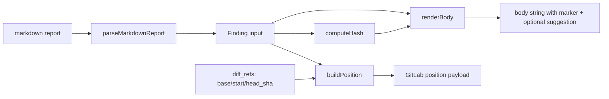

# Phase 1: Scaffolding & helpers (TDD)

## Overview

Create the new file `src/tools/mr-review.ts` with TypeScript types and three pure helper functions, fully test-covered before any GitLab API integration. Establishes the contract used by Phases 2–3.

## Requirements

**Functional**
- Define `Finding`, `PostReviewFindingsArgs`, `PostReviewFindingsResult` types
- `renderBody(finding, hash)` → string. Includes title, body, optional ```suggestion``` block, hidden HTML marker.
- `buildPosition(finding, refs)` → GitLab position payload object (single-line only in v1).
- `computeHash(finding)` → `sha1(file + ':' + (new_line ?? old_line) + ':' + title)`.
- `parseMarkdownReport(md)` → `Finding[]`. Heuristic regex: matches `### [SEVERITY] path:line — title\n<body>`. Returns `[]` when nothing extractable (caller handles single-note fallback).

**Non-functional**
- All helpers pure (no I/O, no `GitLabClient`)
- ≤200 LOC per file
- 100% branch coverage on helpers

## Architecture



```
src/tools/mr-review.ts
├── types: Finding, PostReviewFindingsArgs, PostReviewFindingsResult
├── computeHash(finding): string
├── renderBody(finding, hash): string
├── buildPosition(finding, refs): GitLabPosition
└── parseMarkdownReport(md): Finding[]
```

No exports of `postReviewFindingsTool` yet — Phase 2 adds it.

## Related Code Files

- Create: `src/tools/mr-review.ts`
- Create: `test/tools/mr-review.test.ts`
- Reference (read-only): `src/tools/mr.ts` (style guide), `test/tools/mr.test.ts` (mocking pattern), `src/gitlab-client.ts` (request signature)

## Implementation Steps (TDD)

1. **RED** — write `test/tools/mr-review.test.ts` with failing cases:
   - `computeHash`: deterministic, identical inputs → identical hex; differing line → differing hex
   - `renderBody`: contains title, body, marker `<!-- glab-mcp-finding:HASH -->`; with `suggestion` → contains ```suggestion:-0+0\n...\n``` block
   - `buildPosition`: with `new_line` only → `{ position_type: 'text', new_path, new_line, base_sha, start_sha, head_sha }`; with `old_line` only → `old_path` + `old_line`
   - `parseMarkdownReport`: extracts heading-shaped findings; returns `[]` on free-form markdown
2. **GREEN** — implement helpers minimally. sha1 via `import { createHash } from 'node:crypto'`.
3. **REFACTOR** — extract `MARKER_RE`, `SUGGESTION_FENCE` constants. Confirm file under 100 LOC at this stage.
4. **VERIFY** — `npm test -- mr-review` all green; `npm run build` no errors.

## Todo List

- [ ] Write failing tests for `computeHash` (3 cases)
- [ ] Write failing tests for `renderBody` (with/without suggestion, marker presence)
- [ ] Write failing tests for `buildPosition` (new_line, old_line, both)
- [ ] Write failing tests for `parseMarkdownReport` (positive + negative)
- [ ] Implement helpers — tests green
- [ ] `npm run build` passes

## Success Criteria

- [ ] `npm test -- mr-review` reports all tests pass
- [ ] `npm run build` zero errors
- [ ] `src/tools/mr-review.ts` ≤ 100 LOC at this phase
- [ ] No imports from `GitLabClient` in this file yet

## Risk Assessment

| Risk | Mitigation |
|------|------------|
| Markdown regex too permissive / catches false positives | Negative test cases in `parseMarkdownReport.test`: prose paragraphs, code fences, mixed content |
| Hash collisions across distinct findings | sha1 is sufficient for de-dup (not security); collision space is per-MR, not global |
| GitLab position payload shape drift across versions | Only v1 documented shape used; integration test in Phase 2 will catch real-world drift |

## Next Steps

Phase 2: wire helpers into the orchestrator + perform real GitLab API calls.
