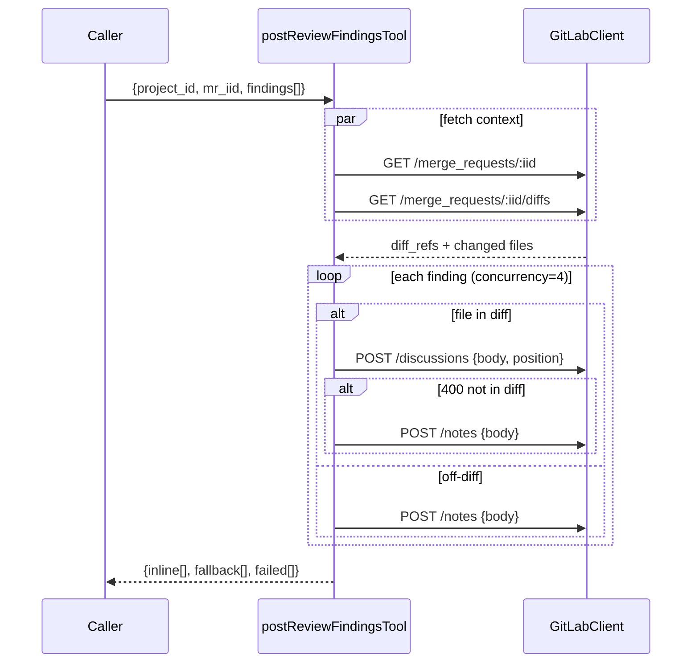

# Phase 2: Core inline post & fallback (TDD)

## Overview

Wire helpers from Phase 1 into the orchestrator `postReviewFindingsTool`. Implements the happy path (post anchored inline discussion) and the off-diff fallback (post general note). No reconcile yet — every finding posts fresh.

## Requirements

**Functional**
- `postReviewFindingsTool(client, args)` async fn that:
  1. Normalizes input — uses `findings` if present; else `parseMarkdownReport(report_markdown)`; if both yield nothing, posts whole markdown as ONE general note and returns
  2. Fetches in parallel: `GET /merge_requests/:iid` (for `diff_refs`) + `GET /merge_requests/:iid/diffs` (for changed-file set)
  3. For each finding: if file ∈ diff → `POST /discussions` with position; else → `POST /notes` with prefix `📌 \`file:line\` (not in diff)`
  4. On `POST /discussions` 400 → retry as general note (defensive fallback)
  5. Bounded concurrency (default 4) using simple promise-pool pattern
  6. Returns `{ inline[], fallback[], failed[] }` (reconcile fields empty until Phase 3)

**Non-functional**
- File under 200 LOC at end of phase
- All network ops via existing `GitLabClient.request` (handles 429 backoff, redaction)
- No `unchanged`/`updated`/`auto_resolved` arrays populated yet

## Architecture

## Related Code Files

- Modify: `src/tools/mr-review.ts` (add orchestrator + concurrency helper)
- Modify: `test/tools/mr-review.test.ts` (integration-style tests with mocked client)
- Reference (read-only): `src/gitlab-client.ts` (for `request<T>(path, init)` signature)

## Implementation Steps (TDD)

1. **RED** — failing tests for orchestrator (`test/tools/mr-review.test.ts`):
   - Happy path: 2 findings on files in diff → 2 `POST /discussions` calls with correct position payloads, both URLs in `result.inline`
   - Off-diff: 1 finding on file not in diff → 1 `POST /notes`, URL in `result.fallback` with `reason: 'off-diff'`
   - Defensive fallback: discussion POST returns 400 → falls back to note, URL in `result.fallback` with `reason: '400'`
   - Markdown fallback (single-note path): no `findings`, unparseable `report_markdown` → exactly ONE `POST /notes` with full markdown body
   - Empty input: `findings: []` and no markdown → returns `{ inline: [], fallback: [], failed: [] }` without API calls
2. **GREEN** — implement orchestrator using helpers:
   - `Promise.all` for the two GET calls
   - Inline `runWithConcurrency(items, limit, fn)` helper (~15 LOC, no new dep)
   - Try/catch around `POST /discussions`; match 400 → fallback path
3. **REFACTOR** — extract `postInlineOrFallback(client, refs, diffFiles, finding)` per-finding fn for readability. Confirm file ≤ 200 LOC.
4. **VERIFY** — `npm test`, `npm run build`.

## Todo List

- [ ] Failing test: happy-path 2 findings
- [ ] Failing test: off-diff fallback
- [ ] Failing test: 400 defensive fallback
- [ ] Failing test: markdown unparseable → single-note
- [ ] Failing test: empty input → no API calls
- [ ] Implement orchestrator + concurrency helper
- [ ] Refactor to per-finding helper
- [ ] All tests green, build clean

## Success Criteria

- [ ] All 5 orchestrator test cases pass
- [ ] `mr-review.ts` ≤ 200 LOC
- [ ] No call to `GET /discussions` yet (reconcile in Phase 3)
- [ ] Concurrency pool serializes to ≤ N concurrent in-flight requests (test with spy + counter)

## Risk Assessment

| Risk | Mitigation |
|------|------------|
| Off-diff detection from `/diffs` payload mis-parses file paths (renames, encoded chars) | Match on `new_path` or `old_path` exact string; integration smoke test against a real MR in Phase 4 |
| Concurrency pool deadlock | Simple index-based pattern (no recursive promises); test asserts all promises settle |
| GitLab 400 message string mismatches "not in diff" wording | Fallback on ANY 400 from `POST /discussions` when payload included `position` — broader, safer |

## Next Steps

Phase 3: add `GET /discussions` baseline + reconcile (update/unchanged/auto_resolve).
