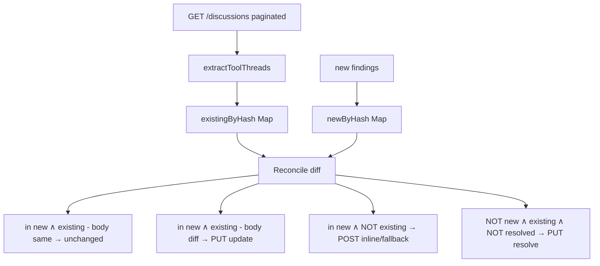

# Phase 3: Reconcile pass (TDD)

## Overview

Add reconcile semantics: scan existing tool-tagged threads, three-way compare against new findings, populate `unchanged[]`/`updated[]`/`auto_resolved[]`. Keeps re-runs idempotent and prevents review spam.

## Requirements

**Functional**
- Add `extractToolThreads(discussions)` helper: parses `<!-- glab-mcp-finding:HASH -->` from root note bodies; returns `Map<hash, { discussion_id, note_id, body, resolved }>`
- Orchestrator gains a third parallel GET: `/merge_requests/:iid/discussions?per_page=100` (paginate if needed)
- Reconcile logic (per spec table in plan.md):
  - hash in new ∧ in existing ∧ body identical → push to `unchanged`
  - hash in new ∧ in existing ∧ body differs → `PUT /discussions/:id/notes/:note_id` → push to `updated`
  - hash in new ∧ in existing ∧ already resolved → push to `unchanged` (leave alone)
  - hash in new ∧ ¬existing → POST inline/fallback as in Phase 2
  - hash ¬new ∧ in existing ∧ ¬resolved → `PUT /discussions/:id` with `resolved=true` → push to `auto_resolved`
- Knobs: `dedupe?: boolean = true` (disables entire reconcile), `auto_resolve_stale?: boolean = true` (disables resolve step only)
- Safety invariant: only threads carrying our marker are ever inspected, updated, or resolved

**Non-functional**
- File still ≤ 200 LOC (split helper to `mr-review-reconcile.ts` if needed)
- All new behavior under feature-flagged knobs; legacy "always post fresh" mode preserved via `dedupe=false`

## Architecture

## Related Code Files

- Modify: `src/tools/mr-review.ts` (add reconcile + third GET + new branches)
- Possibly create: `src/tools/mr-review-reconcile.ts` (only if `mr-review.ts` would exceed 200 LOC)
- Modify: `test/tools/mr-review.test.ts` (add reconcile test cases)

## Implementation Steps (TDD)

1. **RED** — failing tests for reconcile:
   - `extractToolThreads`: discussions with marker → indexed by hash; without marker → ignored; resolved flag preserved
   - Reconcile: identical body → `unchanged[]`, no PUT
   - Reconcile: differing body → `updated[]`, exactly one `PUT /discussions/:id/notes/:note_id`
   - Reconcile: existing resolved → `unchanged[]`, no PUT (human resolved it)
   - Reconcile: new finding not in existing → posts fresh (delegates to Phase 2 path)
   - Reconcile: existing finding not in new → `auto_resolved[]`, exactly one `PUT /discussions/:id` with `{ resolved: true }`
   - `dedupe=false`: skips reconcile entirely; always posts fresh; existing threads untouched
   - `auto_resolve_stale=false`: still updates/skips, but stale threads NOT resolved
   - Pagination: 150 existing discussions across 2 pages → all considered in `existingByHash`
2. **GREEN** — implement reconcile:
   - Paginate `GET /discussions` until response array length < per_page
   - Build maps and diff
   - Wire updates/resolves into result arrays
3. **REFACTOR** — if `mr-review.ts` > 200 LOC, extract reconcile to sibling file. Keep public API on `mr-review.ts`.
4. **VERIFY** — `npm test`, `npm run build`.

## Todo List

- [ ] Failing test: `extractToolThreads` parsing
- [ ] Failing test: identical-body unchanged
- [ ] Failing test: differing-body update
- [ ] Failing test: existing-resolved leave-alone
- [ ] Failing test: stale auto-resolve
- [ ] Failing test: `dedupe=false` skip-reconcile
- [ ] Failing test: `auto_resolve_stale=false` no-resolve
- [ ] Failing test: discussion pagination
- [ ] Implement reconcile + pagination
- [ ] Modularize if file > 200 LOC
- [ ] All tests green, build clean

## Success Criteria

- [ ] All reconcile test cases pass
- [ ] Re-running with identical findings: result has all `unchanged`, zero new POSTs (assert via call-count spy)
- [ ] Removing a finding from input: that thread moves to `auto_resolved`
- [ ] Threads without our marker are never touched (assert via separate test with mixed discussions)
- [ ] Each modified file ≤ 200 LOC

## Risk Assessment

| Risk | Mitigation |
|------|------------|
| Title rephrasing between runs → stale-resolve + new-post pair on same line | Documented; deferred to v1.1 (fuzzy match on `file:line`). Not catastrophic — old thread is just resolved + greyed out |
| Pagination loop runs unbounded if API misbehaves | Hard cap at 10 pages (1000 discussions); error if exceeded |
| Marker regex matches false positives in user-written comments | Marker is a specific HTML comment with `glab-mcp-finding:` prefix + hex hash; extremely low collision risk |
| Auto-resolve on an actively-discussed thread the human wanted to keep | Tool only touches its own tool-tagged threads; if a human reused the marker manually, they're opting in |

## Security Considerations

- No new tokens, no new auth surface — reuses `GitLabClient` PAT
- Resolve is a PUT, not DELETE — fully reversible by reviewer
- No data exfiltration paths added

## Next Steps

Phase 4: register tool in `src/index.ts`, write README, run end-to-end against a real MR.
