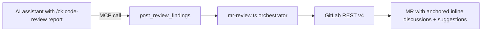

# Phase 4: Tool registration & docs

## Overview

Register `post_review_findings` in `src/index.ts` with a clear, AI-routing-friendly description. Document the tool in `README.md`. Smoke-test against a real GitLab MR. No TDD here — this phase is wiring + docs.

## Requirements

**Functional**
- New MCP tool `post_review_findings` registered with zod input schema
- Tool description hints AI that this is the right tool when a `/ck:code-review` report needs to be posted to a GitLab MR
- README updated: row in tool table + dedicated reference section explaining `findings[]` shape, knobs, return shape
- One live smoke test against a real (test) MR to confirm SHA + position payload work against the actual GitLab instance

**Non-functional**
- Description copy follows existing pattern from `comment_mr`, `list_mr_discussions` (mentions extracting `group/project` and `mr_iid` from URL)
- README change keeps tool list alphabetically/categorically consistent

## Architecture



## Related Code Files

- Modify: `src/index.ts` — `server.registerTool('post_review_findings', { description, inputSchema }, handler)`
- Modify: `README.md` — tool table + reference section
- Reference (read-only): `src/index.ts` existing tool registrations as style template

## Implementation Steps

1. Import `postReviewFindingsTool` from `./tools/mr-review.js` in `src/index.ts`
2. Define zod schema:
   ```ts
   {
     project_id: z.union([z.number(), z.string()]).describe('...'),
     mr_iid: z.coerce.number().int().describe('...'),
     findings: z.array(z.object({...})).optional(),
     report_markdown: z.string().optional(),
     dedupe: z.boolean().optional(),
     auto_resolve_stale: z.boolean().optional(),
     concurrency: z.coerce.number().int().min(1).max(20).optional(),
   }
   ```
3. Register with description: "Post a `/ck:code-review` report as inline anchored discussions on a GitLab MR. Each finding becomes one discussion thread on the exact `file:line`. Re-runs reconcile: updates changed bodies, auto-resolves stale findings, skips unchanged. Off-diff findings fall back to general MR notes."
4. Handler: `JSON.stringify(await postReviewFindingsTool(client, args))` — matches existing pattern
5. Update README:
   - Add row in tool table: `post_review_findings | Post a code-review report as anchored inline MR comments (reconciles on re-run)`
   - Add reference section with full schema + return shape + example
6. Run `npm run build`
7. Live smoke test: configure local glab-mcp pointing at a test MR, invoke with 2 findings (one in-diff, one off-diff), confirm:
   - 1 inline discussion appears on the correct line
   - 1 fallback note appears on the MR
   - Re-running shows 2 `unchanged`, 0 new posts
   - Removing one finding triggers `auto_resolved`

## Todo List

- [ ] Import + register tool in `src/index.ts`
- [ ] Zod schema with descriptive fields
- [ ] `npm run build` clean
- [ ] README tool-table row
- [ ] README reference section
- [ ] Live smoke test against real MR — capture screenshots in journal
- [ ] All unit tests still green (`npm test`)

## Success Criteria

- [ ] `npm run build` produces no errors
- [ ] `npm test` all pass
- [ ] Tool discoverable via MCP client `tools/list`
- [ ] Smoke test posts at least one inline + one fallback comment to a real MR
- [ ] Re-run smoke test produces no new threads (idempotency)
- [ ] README documents schema, return shape, dedupe + auto_resolve knobs

## Risk Assessment

| Risk | Mitigation |
|------|------------|
| Live smoke test against production MR by mistake | Use dedicated test project/MR; document in journal |
| Zod schema description too long for AI tool listing | Keep ≤ 200 chars per field, follow existing tool style |
| Tool name conflicts with future GitLab MCP additions | `post_review_findings` is specific to code-review use case; namespace clear |

## Security Considerations

- Re-uses PAT from existing config — no new credentials handling
- Smoke test confirms no PAT leakage into MR bodies (redaction already in `GitLabClient`)

## Documentation Impact

- [x] README updated
- [ ] Journal entry written via `/ck:journal` after phase complete

## Next Steps

- Optional v1.1: multi-line range support (`line_range` + `line_code` sha)
- Optional v1.1: hash strategy tweak to `file:line` only (avoid stale+new pair on title rephrase)
- Optional follow-up: integration with `/ck:code-review` skill output format so AI doesn't need manual JSON construction
