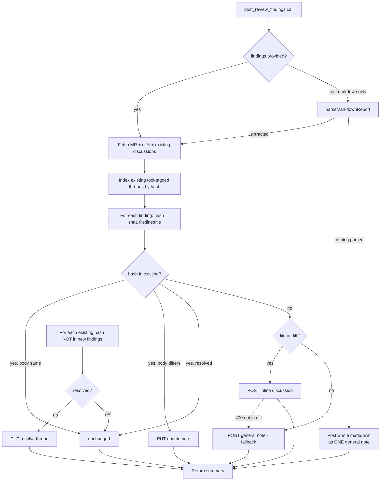

# MR inline review comments from /ck:code-review reports

## Overview

Add `post_review_findings` MCP tool. Takes structured findings (or markdown fallback) from `/ck:code-review` output and posts each as an anchored inline GitLab MR discussion. Reconcile semantics: re-runs update existing tool-tagged threads, auto-resolve stale ones, and never touch human comments. Off-diff findings fall back to general MR notes. Single-line anchoring in v1; multi-line ranges planned for v1.1.

Design source: [`brainstorm-260526-1347-mr-inline-review-comments.md`](../reports/brainstorm-260526-1347-mr-inline-review-comments.md)

## Runtime flow

## Phases

| Phase | Name | Status |
|-------|------|--------|
| 1 | [Scaffolding & helpers (TDD)](./phase-01-scaffolding-helpers-tdd.md) | Completed |
| 2 | [Core inline post & fallback (TDD)](./phase-02-core-inline-post-fallback-tdd.md) | Completed |
| 3 | [Reconcile pass (TDD)](./phase-03-reconcile-pass-tdd.md) | Completed |
| 4 | [Tool registration & docs](./phase-04-tool-registration-docs.md) | Completed |

## Key Dependencies

- GitLab REST v4: `/merge_requests/:iid`, `/merge_requests/:iid/diffs`, `/merge_requests/:iid/discussions`, `/merge_requests/:iid/notes`
- `GitLabClient` (existing, reused — no changes)
- `node:crypto` for sha1
- vitest (existing)
- No new npm dependencies

## TDD Discipline

Every phase: write failing test → minimal implementation → green → refactor. Tests use mocked `GitLabClient.request` (`vi.fn()`) following the pattern already in `test/tools/mr.test.ts`. No live GitLab calls in unit tests.

## Constraints

- TypeScript, ≤200 LOC per file, kebab-case filenames
- Follows existing tool pattern: function in `src/tools/`, registered in `src/index.ts` with zod schema + descriptive `description`
- All responses returned as `JSON.stringify(...)` text content (matches existing tools)
- Zero new npm deps

## Out of Scope

- Multi-line range comments (`line_range` / `line_code`) — v1.1
- Replying within threads
- GraphQL endpoints
- Cross-project finding routing

## Dependencies

<!-- No cross-plan dependencies. Previous plan (260426-1520-mcp-int-coercion) complete. -->
